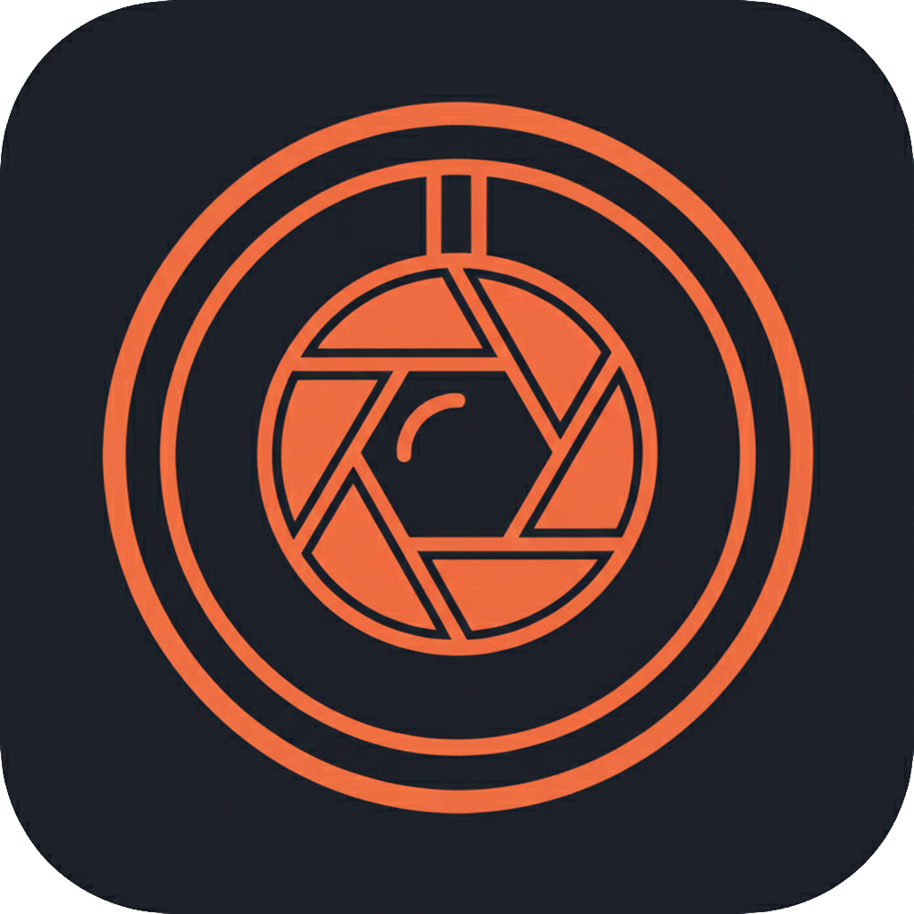

# Outtake

A standalone Android camera and gallery app built with Flutter, designed to organize your photos independently from the system camera.

## Features

- 📷 **Camera** - Capture photos directly within the app
- 🖼️ **Gallery** - Browse and view your images
- ✂️ **Selection Mode** - Select multiple images for batch operations
- 🔍 **Image Viewer** - Zoom and explore image details
- 🗂️ **Independent Storage** - Photos organized in a separate folder

## Tech Stack

- Flutter / Dart
- BLoC pattern for state management
- File system integration for camera/gallery access

## Getting Started

1. Clone the repository
2. Install dependencies: `flutter pub get`
3. Run the app: `flutter run`
